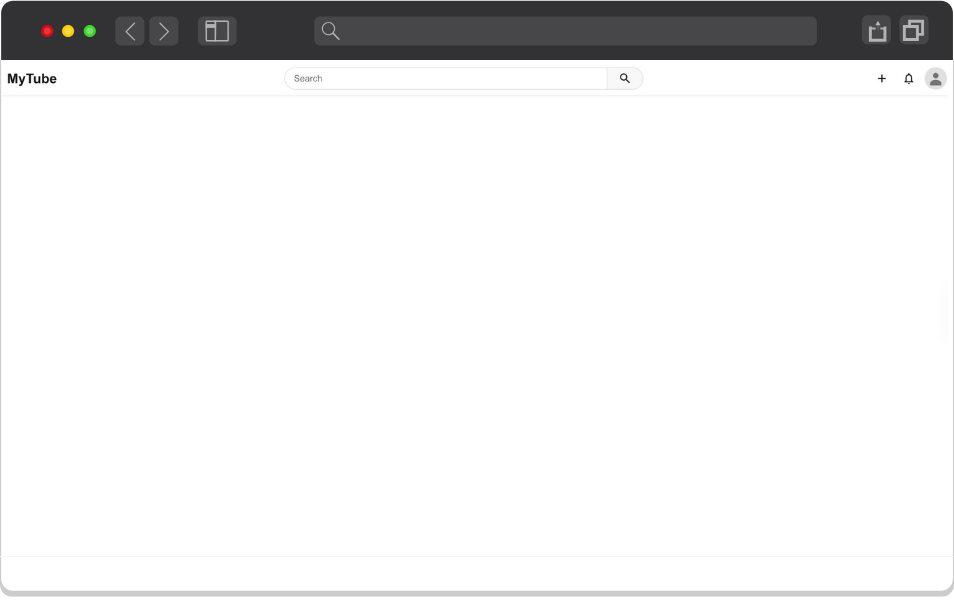

# 01 - Project Architecture And Developer Experience

<div align="center">
   
</div>

## Project Setup

### 1. Create a New Next.js Application

1. Run the following command to create a new Next.js application:

   ```bash
   npx create-next-app@latest
   ```

### 2. Configuration Options

1. When prompted, use these recommended settings:

   | Question               | Answer                      |
   | ---------------------- | --------------------------- |
   | Project name           | mastering-frontend-at-scale |
   | TypeScript             | Yes                         |
   | ESLint                 | Yes                         |
   | Tailwind CSS           | No                          |
   | Use `src/` directory   | Yes                         |
   | Use App Router         | Yes                         |
   | Use Turbopack          | Yes                         |
   | Customize import alias | Yes                         |
   | Import alias           | @/*                         |

### 3. Start Development Server

1. Navigate to the project directory:
   ```bash
   cd mastering-frontend-at-scale
   ```

2. Start the development server:
   ```bash
   npm run dev
   ```

3. Open [http://localhost:3000](http://localhost:3000) in your browser

## Project Structure

### 1. Initial Setup

1. Open the project in your code editor
2. Review the project structure and tools
3. Update `src/app/page.tsx` with a simple component:

   ```tsx
   export default function Home() {
   return <h1>Hello World</h1>;
   }
   ```

### 2. Create Project Folders

1. Create the following directory structure in the `src/` folder:

   ```
   src/
   ├── components/
   ├── constants/
   ├── hooks/
   ├── services/
   ├── stores/
   ├── types/
   └── utils/
   ```

## Building Components

### 1. Add Required Files

1. Copy `Header.module.css` from the start folder to `src/components/Header/`
2. Copy the `default` folder from the start folder to the `public/` directory

### 2. Create Reusable Icon Components

1. Create a new folder: `src/components/Icon`

2. Create three component files that render:

   a. `SearchIcon.tsx`
   ```tsx
     <svg viewBox="0 0 24 24" width="24" height="24" fill="currentColor">
       <path d="M15.5 14h-.79l-.28-.27a6.5 6.5 0 1 0-.7.7l.27.28v.79l5 4.99L20.49 19l-4.99-5zm-6 0A4.5 4.5 0 1 1 14 9.5 4.5 4.5 0 0 1 9.5 14z" />
     </svg>
   ```

   b. `CreateIcon.tsx`
   ```tsx
     <svg viewBox="0 0 24 24" width="24" height="24" fill="currentColor">
       <path d="M19 13h-6v6h-2v-6H5v-2h6V5h2v6h6v2z" />
     </svg>
   ```

   c. `NotificationIcon.tsx`
   ```tsx
     <svg viewBox="0 0 24 24" width="24" height="24" fill="currentColor">
       <path d="M12 22c1.1 0 2-.9 2-2h-4c0 1.1.9 2 2 2zm6-6v-5c0-3.07-1.63-5.64-4.5-6.32V4c0-.83-.67-1.5-1.5-1.5s-1.5.67-1.5 1.5v.68C7.64 5.36 6 7.92 6 11v5l-2 2v1h16v-1l-2-2zm-2 1H8v-6c0-2.48 1.51-4.5 4-4.5s4 2.02 4 4.5v6z" />
     </svg>
   ```

3. Create an `index.tsx` file in the `src/components/Icon` folder to create a central export point for all icon components. This pattern, known as a "barrel file", allows other components to import icons more cleanly using a single import statement:
   ```tsx
   import SearchIcon from './SearchIcon';
   import CreateIcon from './CreateIcon';
   import NotificationIcon from './NotificationIcon';

   export { SearchIcon, CreateIcon, NotificationIcon };
   ```

### 3. Create Reusable Header Component

1. Create a new folder: `src/components/Header`
2. Create `index.tsx` in the Header folder with the following code:

   ```tsx
   <header className={styles.header} role="banner">
   <div className={styles.leftSection}>
      <div className={styles.logo}>
         <span className={styles.logoText}>MyTube</span>
      </div>
   </div>
   <div className={styles.centerSection}>
      <div className={styles.searchContainer}>
         <input
         type="text"
         placeholder="Search"
         className={styles.searchInput}
         aria-label="Search"
         />
         <button
         className={styles.searchButton}
         aria-label="Search button"
         >
         <SearchIcon />
         </button>
      </div>
   </div>
   <div className={styles.rightSection}>
      <button
         className={styles.iconButton}
         aria-label="Create"
      >
         <CreateIcon />
      </button>
      <button
         className={styles.iconButton}
         aria-label="Notification"
      >
         <NotificationIcon />
      </button>
      <button
         className={styles.avatarButton}
         aria-label="User menu"
      >
         <Image
         src="/default/default-avatar.svg"
         alt="User avatar"
         className={styles.avatar}
         width={32}
         height={32}
         />
      </button>
   </div>
   </header>
   ```

### 4. Add Header to Home Page

1. Update `src/app/page.tsx` to include the Header, and remove the "Hello React" text:

   ```tsx
   <>
      <Header />
   </>
   ```


