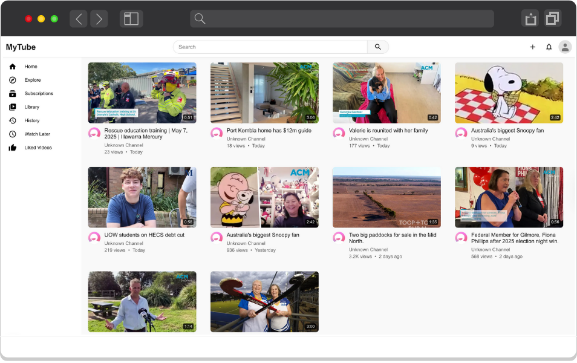

# 02 - Advanced React Patterns And Hooks

<div align="center">
   
</div>

## 1. Create a Reusable Sidebar Component

#### A. Icon Components Setup
1. Copy the following icon components from `start/components/Icon` to `src/components/Icon`:
   - HomeIcon
   - ExploreIcon
   - SubscriptionIcon
   - LibraryIcon
   - HistoryIcon
   - WatchLaterIcon
   - LikedVideosIcon

#### B. Sidebar Component Implementation
1. Create the Sidebar component folder inside `src/components`

2. Copy `Sidebar.module.css` from `start/src/components/Sidebar` to `src/components/Sidebar`

3. Create `src/components/Sidebar/index.tsx` with the following content:
   1. Define menu items configuration
      ```tsx
      const menuItems = [
         { Icon: HomeIcon, label: 'Home', href: '/' },
         { Icon: ExploreIcon, label: 'Explore', href: '/explore' },
         { Icon: SubscriptionsIcon, label: 'Subscriptions', href: '/subscriptions' },
         { Icon: LibraryIcon, label: 'Library', href: '/library' },
         { Icon: HistoryIcon, label: 'History', href: '/history' },
         { Icon: WatchLaterIcon, label: 'Watch Later', href: '/watch-later' },
         { Icon: LikedVideosIcon, label: 'Liked Videos', href: '/liked-videos' },
      ];
      ```
   2. Sidebar component implementation
      ```tsx
      export default function Sidebar() {
         return (
            <aside className={styles.sidebar}>
               <nav className={styles.navigation}>
               {menuItems.map((item) => (
                  <Link key={item.label} href={item.href} className={styles.menuItem}>
                     <item.Icon />
                     <span>{item.label}</span>
                  </Link>
               ))}
               </nav>
            </aside>
         );
      }
      ```

4. Render the Sidebar component in `src/app/page.tsx`:
   ```tsx
   <div className={styles.container}>
     <Header />
     <Sidebar />
   </div>
   ```

## 2. Creating a Reusable VideoCard Component

#### A. Setup Video Card Structure
1. Create the VideoCard folder inside `src/components`

2. Copy required files:
   - Copy `video.ts` from `start/src/services` to `src/services`
   - Copy `formatters.ts` from `start/src/utils` to `src/utils`
   - Copy `index.ts` from `start/src/constants` to `src/constants`
   - Copy `VideoCard.module.css` from `start/src/components/VideoCard` to `src/components/VideoCard`
   - Copy `page.module.css` from `start/src/app/` to `src/app`

#### B. Implement Video Card Component
Create `src/components/VideoCard/index.tsx`:

```tsx
interface VideoCardProps {
  video: Video;
  channelAvatar: string;
}

// Helper function to format video metadata
function getVideoMetadata(video: Video) {
  return {
    viewCount: formatViewCount(video.viewCount),
    publishedAt: video.publishedAt,
    duration: video.duration,
  };
}

export default function VideoCard({ video, channelAvatar }: VideoCardProps) {
  const { viewCount, publishedAt, duration } = getVideoMetadata(video);

  return (
    <div className={styles.videoCard}>
      <Link href={`/watch/${video.id}`}>
        <div className={styles.thumbnailContainer}>
          <Image
            src={video.thumbnailUrl}
            alt={video.title}
            width={320}
            height={180}
            className={styles.thumbnail}
          />
          <div className={styles.duration}>{duration}</div>
        </div>
      </Link>
      <div className={styles.videoInfo}>
        <div className={styles.channelAvatar}>
          <Image
            src={channelAvatar}
            alt={video.channelTitle}
            width={36}
            height={36}
          />
        </div>
        <div className={styles.videoDetails}>
          <h3 className={styles.title}>{video.title}</h3>
          <p className={styles.channelName}>{video.channelTitle}</p>
          <div className={styles.metadata}>
            <span>{viewCount}</span>
            <span>•</span>
            <span>{publishedAt}</span>
          </div>
        </div>
      </div>
    </div>
  );
}
```

### 3. Implementing Video Data Fetching

Update `src/app/page.tsx` to fetch and display videos:

```tsx
export default function Home() {
  const [videosWithChannelAvatars, setVideosWithChannelAvatars] = useState<
    Video[]
  >([]);

  const fetchVideo = useCallback(async () => {
    const videos = await fetchPopularVideos();
    const videosWithChannelAvatars = await Promise.all(
      videos.map(async (video) => {
        const channelAvatar = await fetchChannelInfo(video.channelId);
        return {
          ...video,
          channelAvatar,
        };
      })
    );
    setVideosWithChannelAvatars(videosWithChannelAvatars);
  }, []);

  useEffect(() => {
    fetchVideo();
  }, [fetchVideo]);

  return (
    <div className={styles.container}>
      <Header />
      <Sidebar />
      <main className={styles.main}>
        <div className={styles.videoGrid}>
          {videosWithChannelAvatars.map((video) => (
            <VideoCard
              key={video.id}
              video={video}
              channelAvatar={video.channelAvatar}
            />
          ))}
        </div>
      </main>
    </div>
  );
}
```

### 4. Updating Next Configuration

Update `next-config.ts` with the following code:

```ts
const nextConfig: NextConfig = {
  reactStrictMode: true,
  swcMinify: true,
  compiler: {
    reactRemoveProperties: true,
    removeConsole: process.env.NODE_ENV === 'production',
  },
  images: {
    domains: [
      'www.dailymotion.com',
      'api.dailymotion.com',
      's1.dmcdn.net',
      's2.dmcdn.net',
    ],
  },
  experimental: {
    serverActions: {
      allowedOrigins: ['localhost:3000'],
    },
  },
};
```

## Play time

Add a `console.log` inside the `fetchVideo` function to see how many times it’s called. Compare the results when using `useCallback` versus not using it.