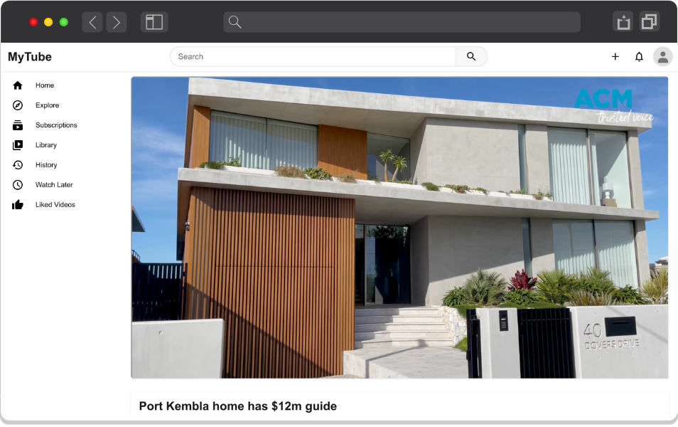

# 03 - State Management At Scale

<div align="center">
   
</div>

## 1. Global State Management

### A. Setting Up Zustand
1. Install Zustand:
   ```bash
   npm install zustand
   ```

### B. Creating a User Store
We'll create a store to manage user-related state, specifically the avatar URL.

1. Create a new file called `userStore.ts` in the `src/stores` folder:
   ```ts
   import { create } from 'zustand';

   interface UserState {
     avatarUrl: string;
     setAvatarUrl: (url: string) => void;
   }

   export const useUserStore = create<UserState>((set) => ({
     avatarUrl: '/default/default-avatar.svg',
     setAvatarUrl: (url) => set({ avatarUrl: url }),
   }));
   ```

### C. Implementing the Store

1. In `src/app/page.tsx`, access the store:
   ```tsx
   const avatarUrl = useUserStore((state) => state.avatarUrl);
   ```

2. Pass the `avatarUrl` to the Header component as a prop

3. Update the `Header` component to accept the prop

4. Use the `avatarUrl` when rendering the avatar image, instead of using a hard coded value:
    ```tsx
    <Image
      src={avatarUrl}
      alt="User avatar"
      className={styles.avatar}
      width={32}
      height={32}
    />
    ```

## 2. Lazy Loading

### A. Implementing Lazy Loading for VideoCard
Lazy loading helps improve initial page load performance by loading components only when needed.

1. In `src/app/page.tsx`, implement lazy loading:
   ```tsx
   const VideoCard = lazy(() => import('@/components/VideoCard'));
   ```

2. Wrap the VideoCard with Suspense for loading states:
   ```tsx
   <Suspense key={video.id} fallback={<div>Loading...</div>}>
     <VideoCard
       key={video.id}
       video={video}
       channelAvatar={video.channelAvatar}
     />
   </Suspense>
   ```

## 3. Custom Hooks

### A. Watch Page Implementation
1. Copy the `start/src/app/watch` folder to `src/app/`
2. Study the implementation to understand:
   - How custom hooks are organized
   - The separation of concerns between components and hooks
   - Note: It’s a good practice to create dedicated components and hooks folders if they are specific only to the page 

## 4. React DevTools

### A. Component Inspection
1. Use the React Components tab to:
   - Inspect component props
   - View component states and props
   - Debug component hierarchy

### B. Performance Analysis
1. Use the React Profiler to:
   - Record component render times
   - Identify performance bottlenecks
   - Analyze component update frequency

## 5. Play Time

### A. Alternative State Management
1. Implement the same state management using React's Context API (`useContext`) instead of Zustand

### B. Advanced Concepts
1. Explore the relationship between time travel debugging and immutability
2. Understand why mutating state directly can lead to issues:
   - Predictability problems
   - Debugging difficulties
   - Performance implications
   - State synchronization challenges
