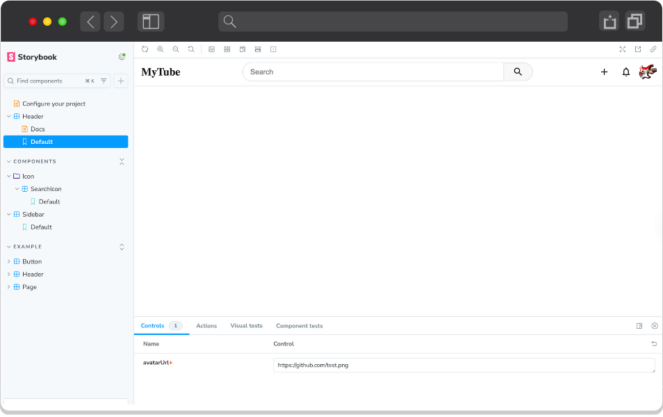

# 05 - Design System And Component Library

<div align="center">
   
</div>

## Getting Started

### 1. Setting Up Storybook

1. Run the following command to create a new Storybook project:
   ```bash
   npm create storybook@latest
   ```

2. When prompted during installation, use these settings:

   | Question                                                            | Answer                                                                                                     |
   | ------------------------------------------------------------------- | ---------------------------------------------------------------------------------------------------------- |
   | What do you want to use Storybook for?                              | Documentation: MDX, auto-generated component docs, Testing: Fast browser-based component tests, watch mode |
   | Do you want to manually choose a Storybook project type to install? | Yes                                                                                                        |
   | Please choose a project type from the following list                | nextjs                                                                                                     |
   | Do you want to migrate?                                             | Yes                                                                                                        |

3. After installation completes, a browser wizard will open to guide you through Storybook features

4. The wizard automatically creates three example components:
   - Button
   - Header
   - Page

5. Storybook adds two new scripts to your `package.json`:
      ```json
      {
      "storybook": "storybook dev -p 6006",
      "build-storybook": "storybook build"
      }
      ```

### 2. Creating Component Stories

1. Create a new file `Header.stories.ts` with the following code:
   ```tsx
   import type { Meta, StoryObj } from '@storybook/react';
   import Header from './';

   const meta = {
      title: 'Header',
      component: Header,
      parameters: {
         layout: 'fullscreen',
      },
      tags: ['autodocs'],
   } satisfies Meta<typeof Header>;

   export default meta;
   type Story = StoryObj<typeof meta>;

   export const Default: Story = {
      args: {
         avatarUrl: 'https://github.com/test.png',
      },
   };
   ```

### 3. Using Storybook

1. Run Storybook:
   ```bash
   npm run storybook
   ```

2. Use the Storybook UI to create additional stories for:
   - SearchIcon component
   - Sidebar component

3. Explore the Storybook UI to:
   - View component documentation
   - Test component interactions
   - Customize component props
   - View component states